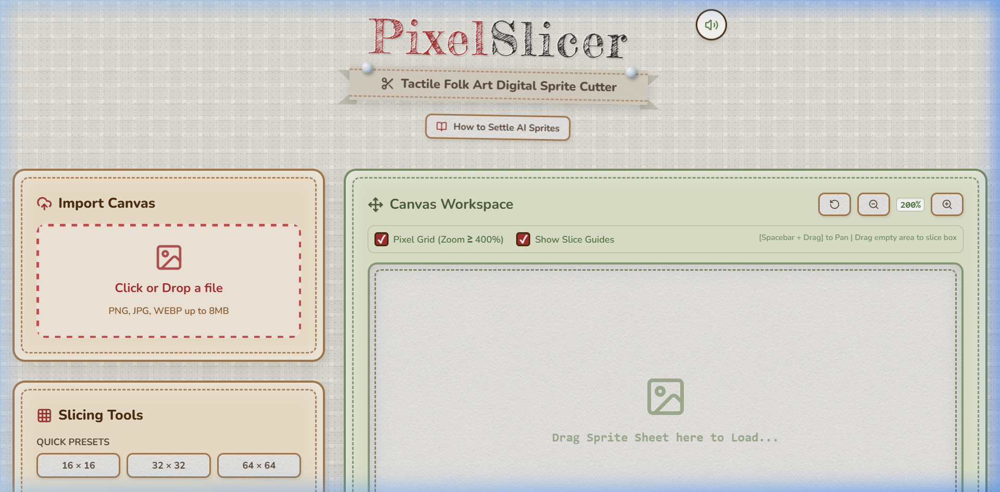
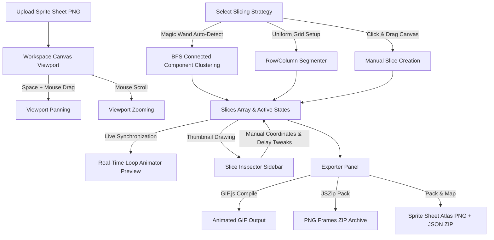

# 🪓 PixelSlicer — Modern Folk Art Digital Sprite Sheet Cutter

[](https://vite.dev/)
[](https://react.dev/)
[](https://tailwindcss.com/)
[](LICENSE)
[](https://vercel.com/new/clone?repository-url=https://github.com/Moha2005269/pixelslicer)

**PixelSlicer** is a tactile digital utility for cutting, tweaking, and exporting pixel art sprite sheets into high-fidelity animated GIFs or game-ready sprite atlases. Built with a rich **Modern Folk Art** design system, the app wraps advanced canvas slicing capabilities in a woven fabric interface with realistic wooden buttons, page transitions, and physical sound-effect synthesis.

🎯 **Live Demo**: [pixelslicerr.vercel.app](https://pixelslicerr.vercel.app)



---

## ✨ Features

*   **⚡ Magic Slicer (Connected-Component Clustering)**: Run a pixel-boundary scanning algorithm using **Breadth-First Search (BFS)** clustering to instantly isolate individual sprites with custom gap margins.
*   **📐 Advanced Grid Slicer**: Cut sheets uniformly using Column, Row, cell size inputs, padding gaps, and offset margins. Supports quick dimensions presets like `16x16`, `32x32`, and `64x64`.
*   **🔍 High-Precision Viewport**: Real-time canvas zooming (up to `16x` magnification) with wheel zooming focused on the cursor, `Spacebar` + drag panning, and optional **Pixel Grid** overlays.
*   **✏️ Vector-Style Manipulation**: Freeform bounding-box editing directly on the workspace. Drag to reposition, resize from any of the 8 resize handles, or draw brand-new slices.
*   **🎬 Real-Time Playback Preview**: Instantly watch loops play inside a checkerboard preview canvas. Supports speed sliders (FPS), looping modes (standard loop vs. Yo-Yo bounce), and individual frame delay modifiers.
*   **📦 Multi-Format Exporters**:
    *   **Animated GIF**: Outputs optimized GIFs at multiple scale multipliers (1x, 2x, 4x, 8x) with crisp nearest-neighbor filters.
    *   **PNG Archive (ZIP)**: Generates separated, crisp PNG frames inside a single ZIP file.
    *   **Sprite Sheet Atlas**: Automatically packs active slices into a single-row sheet alongside a Phaser/Unity-compatible JSON coordinate mapping.
*   **🔊 Physical Audio Synthesis**: Web Audio API-driven clicks, slide sweeps, page rustles, and musical arpeggios representing workspace events, complete with a volume toggler.

---

## 🎨 Woven Folk Art Aesthetic

PixelSlicer is designed to feel like a tactile, physical workspace:
*   **Woven Light Fabric**: Textured woven canvas background with subtle shifting motion.
*   **Embroidered Accents**: Stitched dashed boundaries, paper tags, and drop-shadow details.
*   **Wooden Crafting**: Tactile buttons and selection panels with physical weight, click depressions, and axe-chop animations.

---

## 🗺️ System Architecture & Workflow

Here is how data flows through the **PixelSlicer** workspace:



---

## 🚀 Getting Started

### Prerequisites

Make sure you have Node.js installed on your machine.

### Installation

1. Clone this repository to your local directory:
   ```bash
   git clone https://github.com/your-username/pixelslicer.git
   cd pixelslicer
   ```

2. Install the workspace dependencies:
   ```bash
   npm install
   ```

3. Run the local development server:
   ```bash
   npm run dev
   ```
   Open [http://localhost:5173](http://localhost:5173) (or the port specified in terminal) to access the application.

4. Build the project for production:
   ```bash
   npm run build
   ```

---

## 📂 Project Structure

```
pixelslicer/
├── public/
│   └── demo_spritesheet.png  # Bundled walking knight demo asset
├── src/
│   ├── assets/               # Local icons and logo templates
│   ├── App.jsx               # Core application logic & UI component workspace
│   ├── index.css             # Tailwind v4 import & Folk-Art design definitions
│   └── main.jsx              # Main entry mounter
├── index.html                # Document structure & SEO settings
├── vite.config.js            # Vite configuration with @tailwindcss/vite
├── package.json              # Script runners and package specifications
└── README.md                 # Project documentation
```

---

## 📜 Sprite Atlas Metadata Structure

When exporting as a **Sprite Sheet Atlas**, PixelSlicer returns a ZIP containing the packed PNG atlas alongside a JSON file formatted as follows:

```json
{
  "frames": {
    "Frame_1": {
      "frame": { "x": 0, "y": 0, "w": 128, "h": 128 },
      "rotated": false,
      "trimmed": false,
      "spriteSourceSize": { "x": 0, "y": 0, "w": 128, "h": 128 },
      "sourceSize": { "w": 128, "h": 128 }
    },
    "Frame_2": {
      "frame": { "x": 128, "y": 0, "w": 128, "h": 128 },
      ...
    }
  },
  "meta": {
    "app": "PixelSlicer Folk Art Slicer",
    "version": "1.0.0",
    "image": "atlas.png",
    "format": "RGBA8888",
    "size": { "w": 768, "h": 128 },
    "scale": "4"
  }
}
```

---

## 🤝 Contributing

Contributions are highly welcome! Feel free to open an issue or submit a pull request if you have ideas for aesthetic enhancements or core optimizations.

## 📄 License

This project is licensed under the MIT License — see the [LICENSE](LICENSE) file for details.
